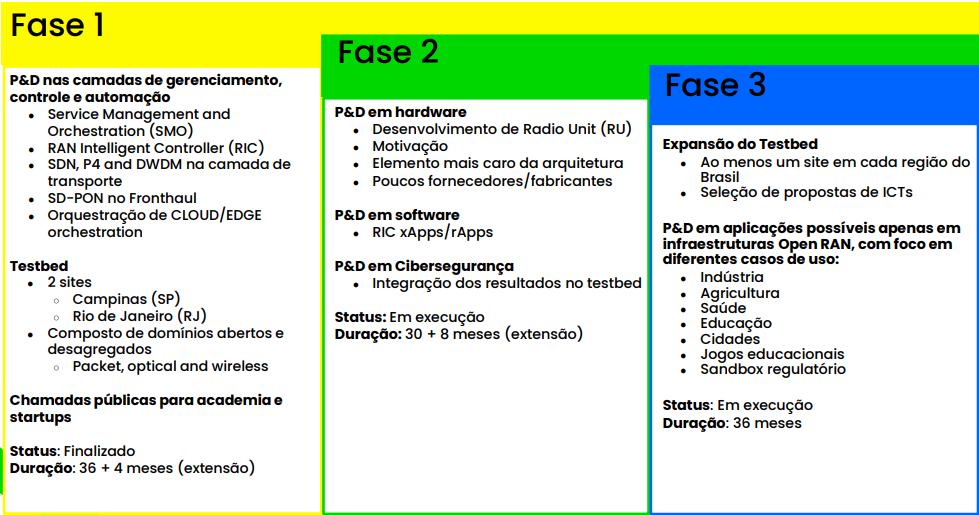

# openRAN@Brasil
Iniciativa multi-institucional apoiado pelo Ministério da Ciência, Tecnologia e Inovações, com recursos da Lei de Informática (nº 8.248, de 23 de outubro de 1991), conforme orientação da Secretaria de Empreendedorismo e Inovação.
Objetivo: Acelerar o desenvolvimento de um ecossistema de rede aberta a partir da investigação, do desenvolvimento, da inovação e da formação da mão-de-obra em tecnologias e aplicações relacionadas com o 5G e além.

Parceiros:
- RNP
- CPQD
- Eldorado
- Inatel
- Universidades: UnB, UFG + grupos de pesquisa e instituições hospedeiras.

Instituições homologadas:
- **RNP**
- **CPQD**
- UFG
- UNB
  
Hospedeiros homologados:
- Região Norte: POP-PA/UFPA e POP-RO/UNIR;
- Região Nordeste: POP-BA/UFBA/IFBA; POP-PB/UFCG; UFPB; UFPE e UFRN;
- Região: Sul: POP-RS/UFRGS/UNISINOS/UFCSPA/PUC-RS; POP-SC/UFSC e UNOCHAPECO.

## Foco do projeto:
- open RAN
- Redes privativas
- Observabilidade e Telemetria
- AR/VR Aplicações, de baixíssima latência (uRLLC) justificando o uso do processamento na borda da rede e tecnologias avançadas como massive MIMO, beamforming e Numerologia:
  - (Exemplo 1)[https://www.youtube.com/shorts/hXGvS9-GlfM]
  - (Exemplo 2)[https://www.youtube.com/watch?v=NOKJDCqvvMk]
  - (Exemplo 3)[https://www.youtube.com/shorts/YZi88PaxW_Q]
  - (Exemplo 4)[https://www.youtube.com/shorts/qRogepIEZeg]
  - (Exemplo 5)[https://www.youtube.com/shorts/RloJBOHU_f0]
- Frequências de:
  - 806 – 809 MHz / 851 – 854 MHz;
  - 2.390 – 2.400 MHz (banda 40 do 3GPP);
  - 2.485 – 2.495 MHz (banda 53 do 3GPP);
  - 3.700 – 3.800 MHz (banda n78 do 3GPP); e
  - 27,5 – 27,9 GHz (banda n261 do 3GPP).

> [!NOTE]
> A Agência não restringe o uso das faixas à determinada tecnologia, devendo ser observados os limites operacionais estabelecidos no requisitos técnicos aprovados. Os Requisitos Técnicos de Condições de Uso do Espectro para as faixas de radiofrequências destinadas ao Serviço Limitado Privado estão consolidados no [Anexo ao Ato nº 915, de 1º de fevereiro de 2024](https://informacoes.anatel.gov.br/legislacao/atos-de-requisitos-tecnicos-de-gestao-do-espectro/2024/1920-ato-915).

- Automação de elementos com ajuda de AI - Telco-AI, AI-RAN
- Sandbox regulatório - AI com 3GPP, O-RAN Alliance and TIP compliance.
- Testar a tecnologia em diferentes splits funcionais da RAN.
- Utilizar diferentes links de backhaul, midhaul e fronthaul. starlink, fibra-otica, microondas e cloud publica/(privada) Servidores. 

## Objetivo do projeto:

Desenvolvimento de aplicações em AR/VR para uso nas mais diversas áreas, habilitando a tecnologia e novas oportunidades:
• Indústria;
• Saúde;
• Cidades e Campus Inteligentes;
• Agricultura 4.0;
• Educação;
• Jogos Educacionais;

## $${\color{red}Coordenador Geral: (RNP credenciada ao CATI) ********* Verificar quem pode acolher:}$$

## As propostas poderão solicitar até R$2.025.000,00 (dois milhões e vinte e cinco mil reais).
### Viagens nacionais e internacionais.
- Simpósios da tecnologia;
- Cursos especializados;
- Feiras de tecnologia.

### Materiais de consumo.
- Cursos

### Aquisição de equipamentos, softwares e materiais permanentes.
- Antenas gNodeBs
- Rádios para 5G (USRP da Ettus Research.) e RUs (Benetel e Foxconn)
- Roteadores e Switches spine de rede.
- Servidores de dados de alta capacidade e GPUs.
- Óculos de realidade aumentada e realidade virtual, consoles e desktops para a aplicação.
- Tecnologias do estado da arte dos dispositivos de AR/VR.
  - [Ocúlos AR](https://www.youtube.com/shorts/EMpCyE54vDw)    
- Licenças e Software
- Equipamentos(keysight) de medições e observabilidade da rede móvel e de transporte.
- Fibra ótica e medidores.
  
### Serviços de terceiro.
- Instalações físicas e montagem.
- Suporte

### Recursos Humanos.
- Especialistas

### Taxas Administrativas ´- Até 15% do valor total do projeto.

### Todas as solicitações devem ter relação com o objetivo do projeto.

## Campos do JEMS
- Anexo II – Proposta: Arquivo da proposta utilizando o modelo indicado.
- Carta de Anuência do Hospedeiro: Aval do coordenador do hospedeiros
- Anexo III – Plano de Aplicação de Recursos: Arquivo do plano de aplicação de
recursos utilizando o modelo indicado.
- Documentos Auxiliares: Carta de comprometimento em aderir ao Sistema RNP; Carta
de Anuência assinada pelo responsável da respectiva unidade do CATI;

## Cenário de Implantação:
$${\color{red} Desagregada: Os elementos ficam distribuídos entre dois ou mais locais distintos.}$$

## Sumário Executivo: Apresentar os objetivos da proposta, incluindo seus principais benefícios.
### Desenvolvimento Tecnológico: Descrever tecnicamente a solução. Apresentar tecnologias, benefícios e impactos. Em caso de parcerias, descrever o papel de cada parceiros.
### Casos de Uso 5G e Open RAN: Com base na aplicação proposta, no hospedeiro indicado e nas funcionalidades do testbed, apresentar um ou mais casos de uso que evidenciem os diferenças do 5G e Open RAN.
### Utilizar como referência o Anexo IV – Capacidades do Testbed.

## Premissas:
### Entregas:
- Relatório de utilização e observabilidade da Rede.
- Dados coletados para uso de modelo para estudos de tráfego de Aplicações AR/VR.
- Backlog, sprints, MVPs e subsequentemente usas versões.
### Plano de 24 meses com a estrutura pronta em setembro de 2026.
### Ano 2 (jan/27 até dez/27): É obrigatório definir e executar atividades de pesquisa e
desenvolvimento no ambiente do hospedeiro indicado.
### Outubro 2027: Entrega de whitepaper com os resultados obtidos da aplicação e dos
respectivos casos de uso.
### O código-fonte do projeto deverá ser disponibilizado ao fim do projeto.

## Projeto
### Eligibilidade
#### Possuir um Coordenador Geral.
#### Parceria [RNP](https://www.rnp.br/sistema-rnp/instituicoes-conectadas/) e credenciado ao [CATI](https://inovacaodigital.mcti.gov.br/ComiteTiCati/instituicoesCredenciadas).
#### Devem ser caracterizadas como projetos de P&D.
#### Devem indicar apenas 01 hospedeiro da lista instituições homologadas como hospedeiros.
#### Devem apresentar um ou mais casos de uso utilizando o hospedeiro indicado.
#### Devem ter alinhamento com uma ou mais verticais de interesse:
#### Indústria 4.0; Saúde; Agro 4.0; Educação Imersiva; Cidades e Campis Inteligentes; Jogos Educacionais
#### Devem evidenciar as potencialidades das tecnologias 5G e Open RAN.

### Recursos
As propostas poderão solicitar até R$2.025.000,00 (dois milhões e vinte e cinco mil reais).
- Viagens nacionais e internacionais.
- Materiais de consumo.
- Aquisição de equipamentos, softwares e materiais permanentes.
- Serviços de terceiro.
- Recursos Humanos.
- Taxas Administrativas ´- Até 15% do valor total do projeto.
- Todas as solicitações devem ter relação com o objetivo do projeto.

### Duração do projeto: 24 meses - De janeiro de 2026 até dezembro de 2027.

### [Planilha de Custos](https://docs.google.com/spreadsheets/d/1F9Llyw9N_hET6075LeDls1bmFReiQkvdJI6oaulGwsQ/edit?hl=pt-br&gid=0#gid=0)

### Apresentação
- Título do Projeto
- Coordenador Geral
- Instituição do Coordenador Geral
- Instituições Parceiras: Devem ser listados os pesquisadores envolvidos.
- Instituição Hospedeira e Coordenador do Hospedeira:
  - Deve ser indicado apenas 01 (huma) instituições hospedeira
  - Utilizar como referência o Anexo I – Instituições Homologadas

### Aplicações 5G open RAN
- Sumário Executivo: Apresentar os objetivos da proposta, incluindo seus principais benefícios.
- Desenvolvimento Tecnológico: Descrever tecnicamente a solução. Apresentar tecnologias, benefícios e impactos. Em caso de parcerias, descrever o papel de cada parceiros.
- Casos de Uso 5G e Open RAN: Com base na aplicação proposta, no hospedeiro indicado e nas funcionalidades do testbed, apresentar um ou mais casos de uso que evidenciem os diferencias do 5G e Open RAN.
Utilizar como referência o Anexo IV – Capacidades do Testbed.

### Premissas:
- A cada quadrimestre deve ser realizada, no mínimo, 01 (huma) entrega.
- O conteúdo da entrega é definido pelo proponente.
- O plano de trabalho deve ter duração de 24 meses.
- Caso a proposta indique uma das instituições com a condição de homologadas, considerar que a infraestrutura estará disponível a partir de setembro de 2026.
- Proponentes poderão utilizar as ilhas já implantadas para realizar os seus trabalhos.
- Ano 2 (jan/27 até dez/27): É obrigatório definir e executar atividades de pesquisa e desenvolvimento no ambiente do hospedeiro indicado.
- Outubro 2027: Entrega de whitepaper com os resultados obtidos da aplicação e dos respectivos casos de uso.
- O código-fonte do projeto deverá ser disponibilizado ao fim do projeto.

### Responsabilidades
- Aquisição, envio e instalação dos equipamentos com custos integralmente cobertos pelo Programa OpenRAN@Brasil.
- Consultoria técnica para instalação e configuração dos equipamentos.
- Contratação de bolsista até dezembro de 2027 para manutenção e operação da ilha.
  - Valor Mensal: R$2.400,00 (dois mil e quatrocentos reais)
- Caso necessário, custeio da adequação do ambiente físico:
  - Valor máximo de R$150.000,00
  - Apenas atividades realizadas por empresa especializada em infraestrutura de redes serão custeadas
